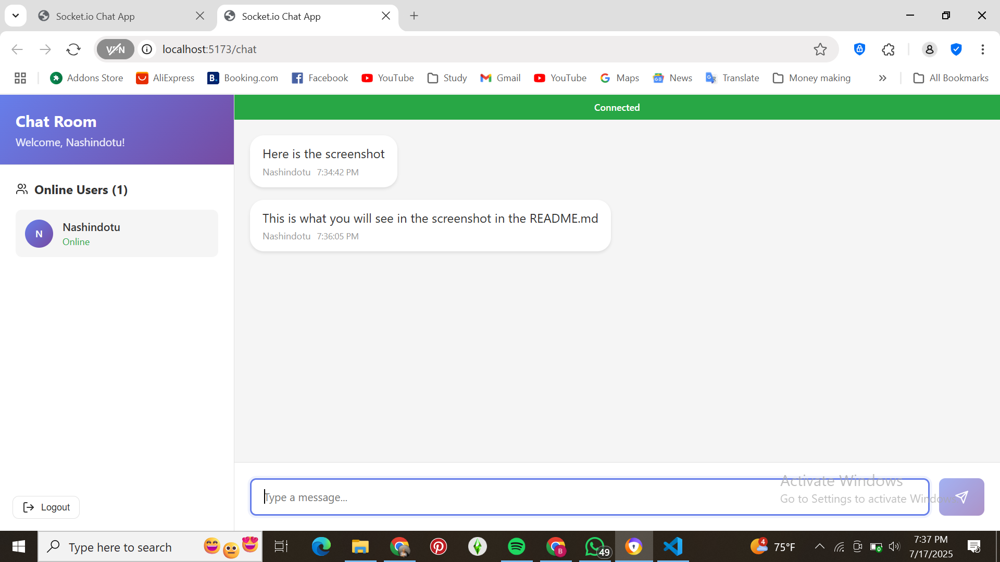

# Real-Time Chat Application with Socket.io

This assignment focuses on building a real-time chat application using Socket.io, implementing bidirectional communication between clients and server.

## Assignment Overview

You will build a chat application with the following features:
1. Real-time messaging using Socket.io
2. User authentication and presence
3. Multiple chat rooms or private messaging
4. Real-time notifications
5. Advanced features like typing indicators and read receipts

## Project Structure

```
socketio-chat/
├── client/                 # React front-end
│   ├── public/             # Static files
│   ├── src/                # React source code
│   │   ├── components/     # UI components
│   │   ├── context/        # React context providers
│   │   ├── hooks/          # Custom React hooks
│   │   ├── pages/          # Page components
│   │   ├── socket/         # Socket.io client setup
│   │   └── App.jsx         # Main application component
│   └── package.json        # Client dependencies
├── server/                 # Node.js back-end
│   ├── config/             # Configuration files
│   ├── controllers/        # Socket event handlers
│   ├── models/             # Data models
│   ├── socket/             # Socket.io server setup
│   ├── utils/              # Utility functions
│   ├── server.js           # Main server file
│   └── package.json        # Server dependencies
└── README.md               # Project documentation
```

## Getting Started

1. Accept the GitHub Classroom assignment invitation
2. Clone your personal repository that was created by GitHub Classroom
3. Follow the setup instructions in the `Week5-Assignment.md` file
4. Complete the tasks outlined in the assignment

## Files Included

- `Week5-Assignment.md`: Detailed assignment instructions
- Starter code for both client and server:
  - Basic project structure
  - Socket.io configuration templates
  - Sample components for the chat interface

## Requirements

- Node.js (v18 or higher)
- npm or yarn
- Modern web browser
- Basic understanding of React and Express

## Features
### Core functionality

1. Real-time messaging with Socket.io
2. User authentication (username-based)
3. Global chat room for all users
4. Message display with sender names and timestamps
5. Typing indicators
6. Online/offline user status

### Advanced features 

1. Private messaging between users
2. Multiple chat rooms/channels
3. File and image sharing
4. Message reactions (like, love, etc.)
5. Read receipts
6. Real-time notifications
7. Sound notifications
8. Browser notifications (Web Notifications API)
9. Message pagination
10. Auto-reconnection logic
11. Message search functionality
12. Responsive design for mobile and desktop

## Chat App Demo

Below is a screenshot showing real-time messaging with Socket.io:


